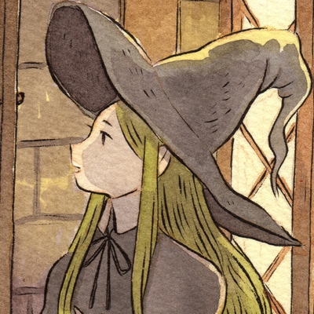

# Projet_MTdV2023

Ce dépôt a été créé par les élèves de M2 TAL Ingénieurie Multilingue de l'INALCO. Le but de ce projet est de réaliser un complilateur qui transforme les programmes MTdV+ en programme MTdV classique.

## Groupe 1: création d'un analyseur syntaxique de la MTdV+

>>>
{width=100 height=100px}
**Alice XXX** \
Bla Bla Bla
>>>

 

>>>
{width=100 height=100px}
**Kenza XXX** \
Bla Bla Bla
>>> 

 

>>>
{width=100 height=100px}
**Liza XXX** \
Bla Bla Bla
>>> 

## Groupe 2 : création d'un gestionnaire des noms de variables

>>>
{width=100 height=100px}
**Laura Darenne** \
Bla Bla Bla
>>>

 

>>>
{width=100 height=100px}
**Shami Thirion Sen** \
Bla Bla Bla
>>> 

## Groupe 3 : création d'un allocataire et gestionnaire de mémoire

>>>
{width=100 height=100px}
**Tifanny XXX** \
Bla Bla Bla
>>>

 

>>>
{width=100 height=100px}
**Clément XXX** \
Bla Bla Bla
>>> 

 

>>>
{width=100 height=100px}
**Fanny XXX** \
Bla Bla Bla
>>> 

## Groupe 4 : création d'un générateur de code MTdV à partir de la MTdV+

>>>
{width=100 height=100px}
**Tifanny XXX** \
Bla Bla Bla
>>>

 

>>>
{width=100 height=100px}
**Sandra XXX** \
Bla Bla Bla
>>> 

 

>>>
{width=100 height=100px}
**Valentina XXX** \
Bla Bla Bla
>>>

 

>>>
{width=100 height=100px}
**Valentina XXX** \
Bla Bla Bla
>>> 